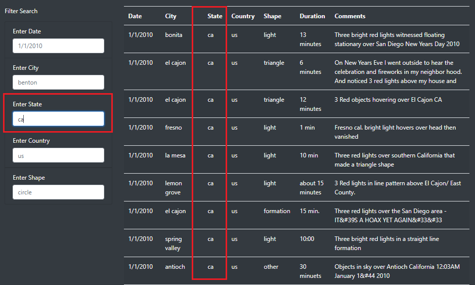
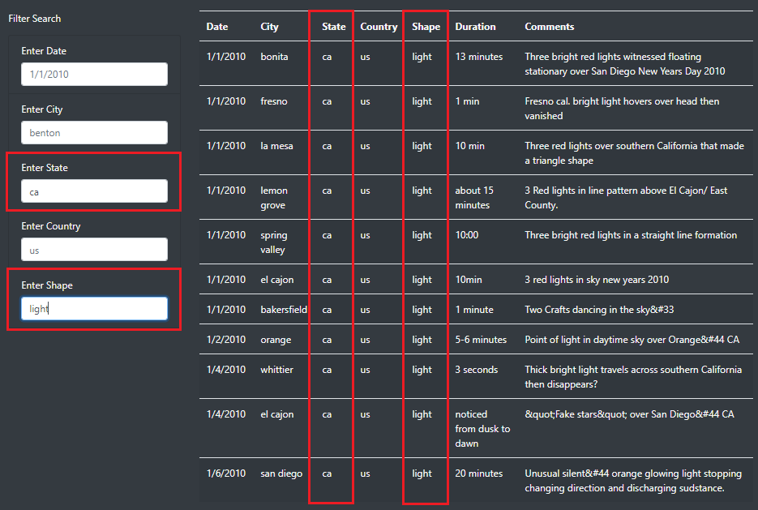

# UFOs

## Project Overview

The purpose of this analysis is to develop an interactive webpage that provides details on UFO sightings. The webpage is equipped with a dynamic table that allows users to filter by multiple criteria at the same time. The user will be able to narrow down their search by a specific **Date, City, State, Country, or Shape**.

## Resources
- Data Source: [UFO Sightings](static/js/data.js)
- Software: Visual Studio Code 1.54.2
- Languages: JavaScript, HTML, CSS, BootStrap 4.0.0

## Results

### [The Truth Is Out There](https://joshb738.github.io/UFOs/)

The interactive filters allow the user to enter the desired criteria into a field which will automatically return the results when the user proceeds to click on the following field or anywhere on the webpage.

**Filter by Single Criteria**

   

**Filter by Multiple criteria**

  

### Limitations:
The user must adhere to the following filter field parameters in order to return the correct results:

**Date** 
- date must be entered in the following format (M/D/YYY).
- e.g. January 01, 2010 = 1/1/2010, November 13, 2010 = 11/13/2010

**City**
- input must be lowercase with full spelling
- e.g. Fresno = fresno

**State**
- input must be lowercase abbreviation without symbols
- e.g. California = california

**Country**
- input must be lowercase abbreviation without symbols
- e.g. United States = us

**Shape**
- input must be lowercase with full spelling
- e.g. cirlce, light, triangle 

## Summary

One evident drawback of the current design are all the filter fields are user-input free text. This means there is increased risk of user input error which may return incorrect or null search results. 

### Suggestions for potential design improvements

- Modify the free-text input field to a pre-filled dropdown selection for the City, State, Country, and Shape. Dropdown selections help prevent the issue of user input errors such as Case sensitivity & spelling errors.

- Modify the Date field to a "Date Picker" or restrict the input to only numeric values.

- Addition of a "Clear Filters" button.

## Work Cited

#### Modifying the input fields to force case-sensitivity for filters.

- Ref.Lines: [70, 75, 80, 85](index.html): 5. CSS to the rescue - (https://www.the-art-of-web.com/html/input-field-uppercase/)
